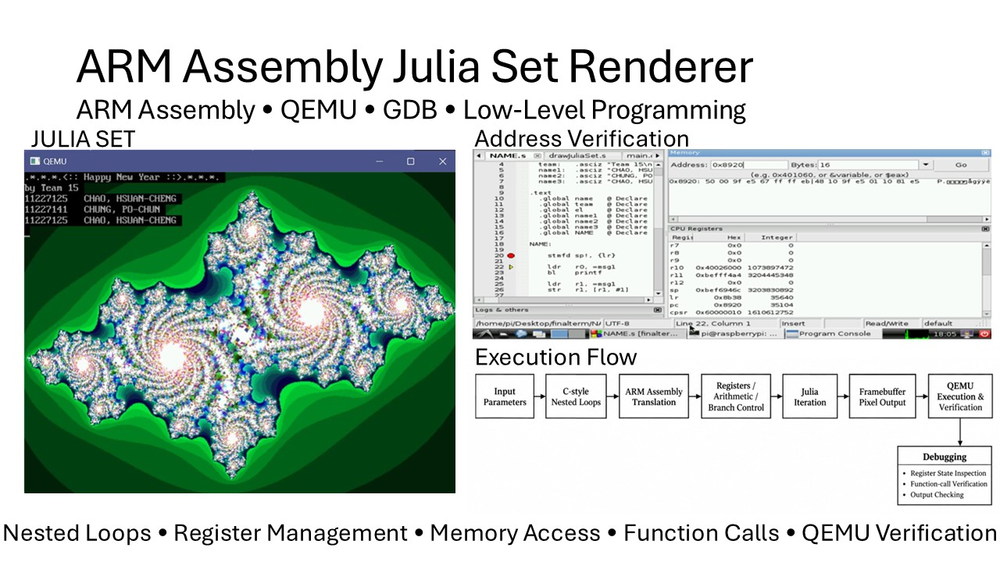
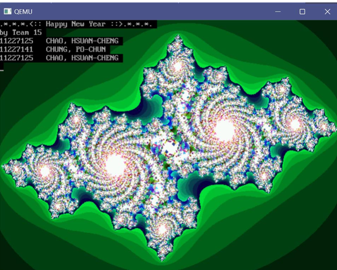

# ARM Assembly Julia Set Renderer

A Julia Set renderer implemented with ARM Assembly and executed in a QEMU environment, focusing on low-level computation, register management, memory access, function calls, and debugging.



## Overview

This project implements the core rendering process of a Julia Set fractal using ARM Assembly.

The main challenge was translating higher-level iterative logic into low-level ARM instructions. Instead of relying on high-level loop structures and variables, the implementation manually manages registers, arithmetic operations, branch conditions, function calls, and framebuffer memory access.

The final program generates Julia Set images and displays the rendered result in the QEMU environment.

---

## Core Execution Flow

```text
Input Parameters
       ↓
C-style Nested Loop Logic
       ↓
ARM Assembly Translation
       ↓
Register / Arithmetic / Branch Control
       ↓
Julia Set Iteration
       ↓
Framebuffer Pixel Output
       ↓
QEMU Execution & Verification
```

At a high level, the renderer processes each pixel position, performs the Julia Set iteration, determines the corresponding pixel value, and writes the result to the framebuffer.

---

## Core Concepts

### 1. Nested Loop Translation

The rendering algorithm requires iteration over a two-dimensional image region.

High-level loop logic is translated into ARM Assembly using:

- Registers as loop variables
- `CMP` for condition checking
- Conditional branch instructions
- Manual increment and control flow
- Explicit management of intermediate values

This provided practical experience in understanding how high-level control structures are represented at the instruction level.

### 2. Register Management

Registers are used to store:

- Loop counters
- Coordinates
- Intermediate arithmetic results
- Function parameters
- Memory addresses

Because the number of available registers is limited, values must be carefully allocated and preserved during computation.

Register management became one of the most important parts of the implementation and debugging process.

### 3. Julia Set Computation

For each pixel, the program repeatedly evaluates the Julia Set recurrence and determines whether the corresponding point remains within the required iteration condition.

The implementation requires repeated arithmetic operations, comparisons, and branches entirely through ARM instructions.

### 4. Framebuffer Output

After calculating the result for a pixel, the program writes the corresponding value to the framebuffer memory.

This connects the low-level numerical computation directly to the final visual output.

---

## Rendering Result

The completed ARM Assembly implementation successfully generates Julia Set images in QEMU.



Different parameters produce different fractal structures, allowing the program output to visually demonstrate whether the iterative computation and pixel addressing are working correctly.

---

## Debugging & Verification

Low-level debugging was one of the most important parts of this project.

During development, problems such as incorrect output and execution failures could result from register values being unintentionally overwritten.

One notable issue occurred when calling the ARM division routine:

```text
__aeabi_idiv
```

The initial assumption was that only `r0` needed to be considered after the function call. During debugging, it became necessary to account for additional registers whose values could be modified across the call.

This required:

- Inspecting register states
- Checking actual memory addresses
- Tracking values before and after function calls
- Preserving required register values
- Repeatedly verifying the rendered output

The debugging process demonstrated why calling conventions and register preservation are critical in low-level programming.

---

## Technical Highlights

| Area | Implementation |
| --- | --- |
| Language | ARM Assembly |
| Execution Environment | QEMU |
| Control Flow | Manual loops and conditional branches |
| Computation | Integer arithmetic and iterative Julia Set calculations |
| Register Usage | Parameters, loop counters, intermediate values and addresses |
| Memory | Framebuffer pixel access |
| Debugging | Register and memory-address inspection |
| Verification | Visual Julia Set output and runtime checking |

---

## My Contribution

This project was completed as a two-person team project.

My main responsibilities included:

- Debugging the ARM Assembly implementation
- Tracing register-related execution problems
- Verifying register values and memory addresses
- Handling additional assignment requirements
- Testing program behavior and rendered output
- Verifying the final Julia Set results in QEMU

A major part of my work focused on identifying low-level execution problems that were difficult to locate through source-code inspection alone.

---

## Key Challenge

The most significant challenge was adapting from high-level programming habits to explicit register and memory management.

In a high-level language, temporary values and function-call behavior are largely managed by the compiler. In ARM Assembly, incorrect assumptions about register preservation can directly cause corrupted values, incorrect rendering, or runtime failures.

Debugging these issues helped build a much clearer understanding of:

```text
Function Call
     ↓
Argument Registers
     ↓
Register Clobbering
     ↓
Value Preservation
     ↓
Correct Execution
```

---

## What I Learned

Through this project, I gained practical experience with:

- ARM Assembly programming
- Translating high-level control flow into assembly instructions
- Register allocation and preservation
- Conditional branches and nested loops
- Function calling behavior
- Memory and framebuffer access
- Low-level debugging
- QEMU-based execution and verification

More importantly, the project helped me understand that low-level programming is not only about producing correct output, but also about understanding how data moves through registers, memory, and function calls during program execution.
